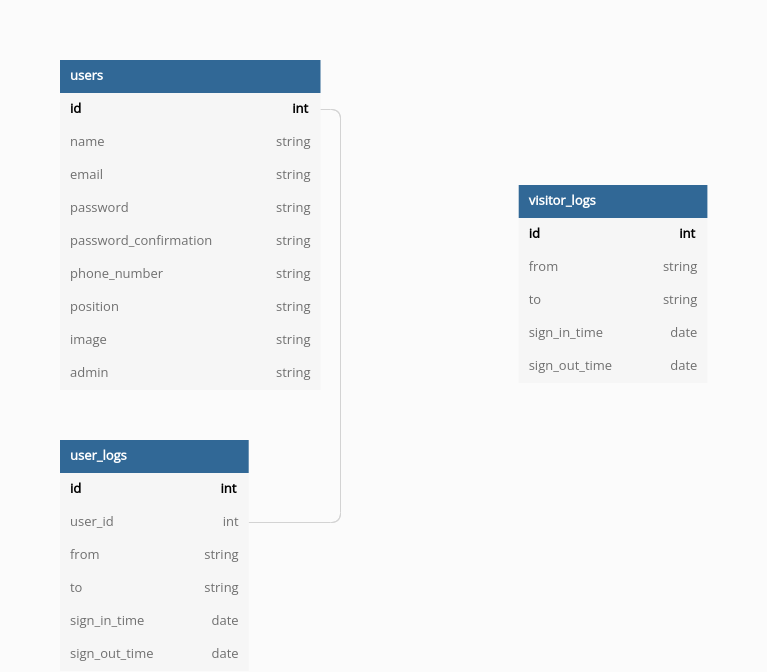

# ATTENDANCE REGISTRY API

This is an API for an attendance register management system. This API is intended to be used in a mobile and web system to ensure users are able to login and fill in the data necessary to manage daily attendance of employees.



## Tech Stack Used

  - Ruby on Rails 7
  - PostgreSQL

## How to consume the API

  - The API can be accessed on this link ```https://ellipsisattendance.herokuapp.com```

## END POINTS USED

### Employees End points

|#	|Routers	|Method	|Progress	|Is Private	|Description|
|---|---------|-------|---------|-----------|-----------|
|1	|```/users```	|POST	|Done	|No	|Create a new employee|
|2	|```/users/sign_in```	|POST	|Done	|No	| Log in user|
|3	|```/users```	|PUT	|Done	|Yes	|Update an employee's details|
|4	|```/users/sign_out```	|DELETE	|Done	|Yes	|Log out an employee's session|
|5	|```/users```	|DELETE	|Done	|Yes	|Delete an employee from database|

#### How to Register a user:

1. End point to use: ```https://ellipsisattendance.herokuapp.com/users```
2. Action to use: <strong>POST</strong>

3. Enter the details as follows to register any user with his/her credentials. 

```
  {
    "user": {
      "name": "Someone Someone",
      "email": "someone@someone.com",
      "password": "123456789",
      "password_confirmation": "123456789"
    }
  }
```

#### How to Login a user:

1. End point to use: ```https://ellipsisattendance.herokuapp.com/users/sign_in```
2. Action to use: <strong>POST</strong>

3. Enter the details as follows to sign in any user with his/her credentials. 

```
  {
      "email": "someone@someone.com",
      "password": "123456789"
  }
```

#### How to fetch all users:

1. End point to use: ```https://ellipsisattendance.herokuapp.com/users```
2. Action to use: <strong>GET</strong>


#### How to fetch a single user
1. End point to use: ```https://ellipsisattendance.herokuapp.com/user/:id```
2. Action to use: <strong>GET</strong>


### Employee Logs end points

#### Only an admin user can access these end points

|#	|Routers	|Method	|Progress	|Is Private	|Description|
|---|---------|-------|---------|-----------|-----------|
|1	|```/user_logs```	|GET	|Done	|Yes	|Get all employees logs as an admin user|
|2	|```/user_log/:id```	|GET	|Done	|Yes	|Get an employee's log as an admin user|


### Visitor Logs End points

#### Only an admin user can access these end points

|#	|Routers	|Method	|Progress	|Is Private	|Description|
|---|---------|-------|---------|-----------|-----------|
|1	|```/visitor_logs```	|GET	|Done	|No	|Get all visitor logs|
|2	|```/visitor_log/:id```	|GET	|Done	|No	|Get a single visitor log detail|
